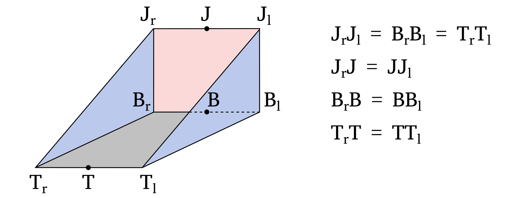

.. _bucket:

Documentation for the excavator bucket
======================================

General description of the simulated excavator bucket
-----------------------------------------------------

The excavator's bucket has usually a complex shape that is not suitable for first-order modelling.
In this simulator, the bucket is approximated as a triangular prism to simplify its representation.
An illustration of the simulated bucket is provided below.

The different parts of the bucket are labeled as follows:

* :code:`J` represents the bucket joint.
* :code:`B` represents the bucket base.
* :code:`T` represents the bucket teeth.
* The surface defined by the vertices :math:`T_lT_rB_rB_l` is referred to as the bucket base.
* The surface defined by the vertices :math:`J_lJ_rB_rB_l` is referred to as the bucket back.
* The surface defined by the vertices :math:`J_rB_rT_r` is referred to as the bucket right side.
* The surface defined by the vertices :math:`J_lB_lT_l` is referred to as the bucket left side.
* The surface defined by the vertices :math:`J_lJ_rT_rT_l` is referred to as the bucket front. Note that it does not correspond to a bucket wall.

The reference pose of the bucket is specified when creating the :code:`Bucket` class and is defined by the fields :code:`j_pos_init_`, :code:`b_pos_init_`, and :code:`t_pos_init_`, which correspond to the positions of the bucket joint, base, and teeth, respectively.
The centre of rotation for the bucket is typically the bucket joint, but it can be a different point depending on the specific bucket design.
In that case, a different bucket origin (:code:`o_pos_init`) can be provided when building :code:`Bucket`.
The position of the bucket joint, base, and teeth are generally defined relative to the bucket origin.

The pose of the bucket (:code:`pos_`) is provided to the simulator as the Cartesian position of the bucket origin and its orientation (:code:`ori_`) relative to the reference pose, using the :code:`Quaternion` notation.

Determination of the bucket position
------------------------------------

The first task of the simulator is to determine the position of the excavator bucket within the 3D grid.
This is done by the :code:`CalcBucketPos` function in the :code:`bucket_pos.cpp` file.
Specifically, it aims to identify, for each XY position in the grid, the minimum and maximum height of the bucket walls if present at that location.
The algorithm used for this task has been optimized for performance, resulting in an efficient implementation.
However, due to the optimization, the algorithm may appear complex or unintuitive.

The basic idea under the implementation is to decompose the bucket into its 4 surfaces (base, back, left side, right side), and to identify for each XY position of the grid the minimum and maximum height of the given bucket wall.
The results for the four surfaces are then aggregated and sorted.
It is then straightforward to determine for each XY position the minimum and maximum height of the bucket using this information.
Although a different implementation is present for the rectangular surfaces (base and back) and for the triangular surfaces (left and right side), the algorithm is almost identical.

The position of the bucket wall is determined using a three-steps process:

* Each XY position within the bounding box of the bucket wall is decomposed into the reference vectors of the considered surface.
  This allows to easily determine whether a given XY position falls inside or outside the projection of the bucket wall into the horizontal plane.
* For each XY position (:code:`ii`, :code:`jj`) within the projection of the bucket wall into the horizontal plane, the height of the bucket wall at the cell corner (:code:`ii + 0.5`, :code:`jj + 0.5`) is calculated and added to the tally.
  By iterating over all the cells, the algorithm ensures that the height of the bucket is calculated at the 4 corners of each cell within the projection of the bucket wall into the horizontal plane.
  This is crucial because the minimum and maximum height of a plane intersecting laterally a cell is occurring necessarily at one of the cell's corner.
* An issue of this algorithm is that it does not handle the case where the bucket wall is either not fully intersecting the cell or intersecting vertically the cell.
  Those cases are handled separately by identifying all the cells where the edges of the bucket wall are located.

The algorithm to identify all the cells that lie on the edge of a bucket wall follow the implementations proposed by Amanatides and Woo in the article "A Fast Voxel Traversal Algorithm for Ray Tracing".
The reader is invited to read this article for a detailed explanation of the algorithm, here only a general description will be given.
In this implementation, the gradient of the straight line is used to determine how long it is necessary to travel along the line before to cross a cell boundary in the three directions.
Knowing this information, it is then possible to travel along the line while identifying all the cell boundaries that are crossed.
